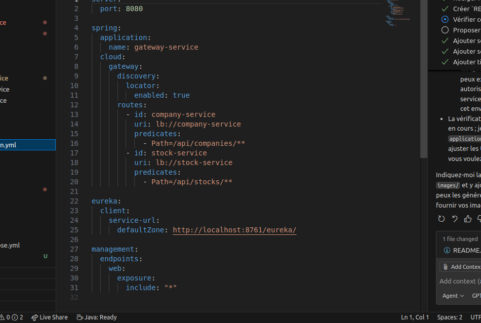
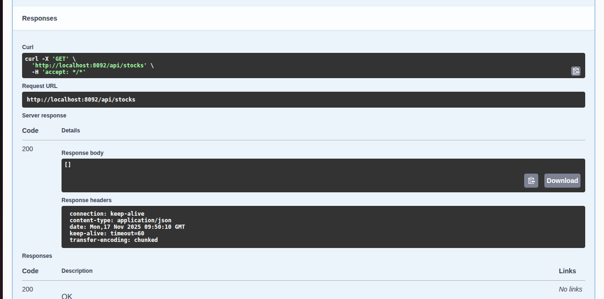
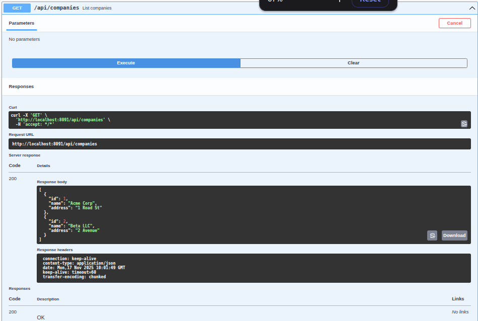
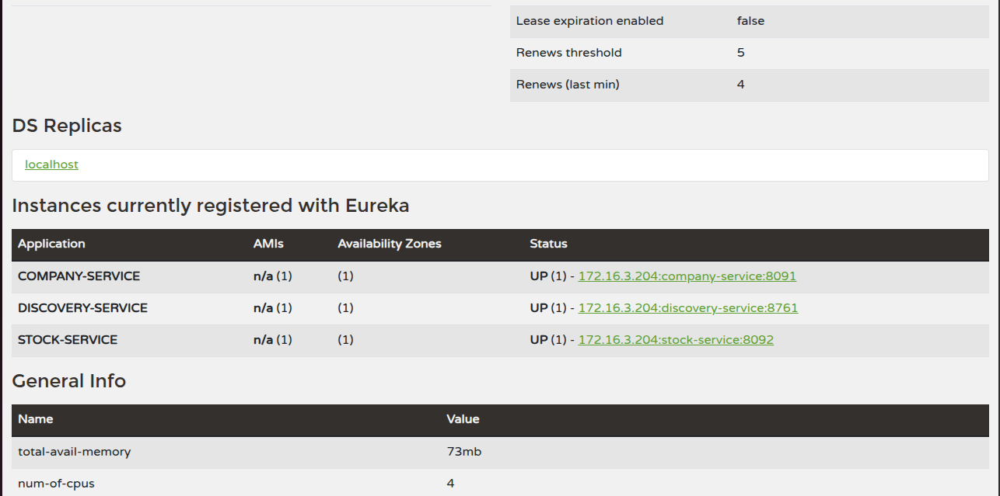
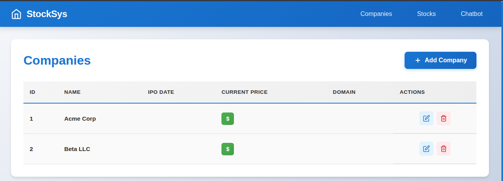
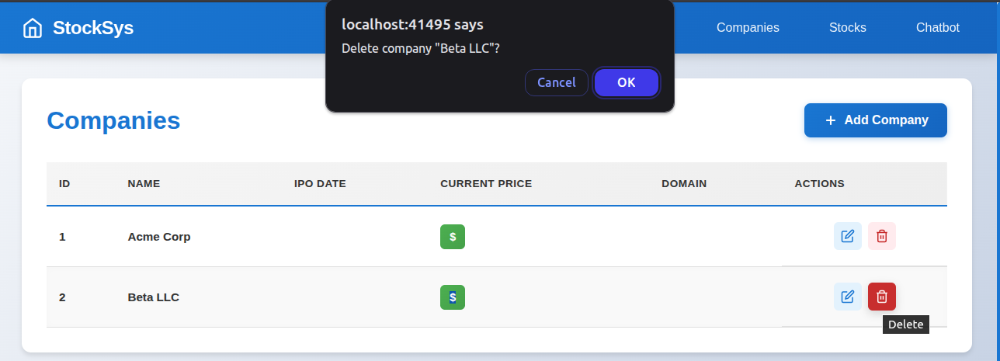

# Projet Spring-React — Architecture Microservices (FR)

## Vue d'ensemble

Ce dépôt contient une application de démonstration qui illustre une architecture microservices basée sur Spring Boot (Java) et des services indépendants packagés via Docker. Le projet inclut plusieurs microservices typiques d'une application de type e‑commerce, une passerelle API, un service de découverte et des outils annexes.

Arborescence principale (extraits) :

- `chat-bot-service/` — microservice de chatbot
- `company-service/` — service métier principal (ex : gestion d'entreprises/produits)
- `discovery-service/` — service Eureka/Consul pour l'enregistrement des services (découverte)
- `gateway-service/` — passerelle API (route, sécurité, agrégation)
- `stock-service/` — service de gestion des stocks
- `docker-compose.yml` — configuration multi-conteneurs pour démarrage local
- `pom.xml`, `mvnw` — projet parent et wrapper Maven

> Remarque : le frontend React n'est pas inclus dans ce dépôt (nom du dépôt historique). Les services exposent des APIs REST et s'intègrent facilement avec une SPA React.

## Configuration et conventions

- Chaque service possède son propre module Maven avec un `pom.xml` et un `src/main/resources/application.yml`.
- Les fichiers `target/classes/application.yml` présents dans l'arborescence sont des artefacts de build ; modifiez plutôt les fichiers sous `src/main/resources/`.
- Les services communiquent via HTTP/REST (JSON). Selon le besoin, la passerelle peut ajouter des fonctionnalités cross-cutting (authentification, logging, throttling).

Ports par défaut (peuvent varier selon configuration locale) :

- `discovery-service` : 8761 (exemple pour Eureka)
- `gateway-service` : 8080
- `company-service` : 8091
- `stock-service` : 8092
- `chat-bot-service` : 8093

Consultez `src/main/resources/application.yml` dans chaque module pour confirmer/adapter les ports.

# Create a company
curl -X POST http://localhost:8091/api/companies -H "Content-Type: application/json" -d '{"name":"Acme","address":"1 Road"}'

# List companies
curl http://localhost:8091/api/companies

# Create stock
curl -X POST http://localhost:8092/api/stocks -H "Content-Type: application/json" -d '{"companyId":1, "quantity":100}'

# Chat bot
curl -X POST http://localhost:8093/api/chat -H "Content-Type: application/json" -d '{"question":"Hello"}'

Gateway routes:

# Swagger / OpenAPI UI

Documentation interactive (Swagger UI) disponible pour chaque microservice :

- Company: http://localhost:8091/swagger-ui.html
- Stock: http://localhost:8092/swagger-ui.html
- Chat: http://localhost:8093/swagger-ui.html

Image (exemple) :

Image (exemple) :

Description courte :

La page Swagger UI permet d'explorer et tester les endpoints exposés par le microservice Company. Vous pouvez exporter la spécification OpenAPI au format JSON via `/v3/api-docs`.

Postman collection included: `postman_collection.json`

## Eureka / Discovery — Page d'administration

Titre : Console Eureka (Discovery Service)

Description courte :

La console Eureka affiche l'état des services enregistrés (instances, statut, timestamp). C'est la première interface à vérifier en cas d'indisponibilité des services.

Image (exemple) :

## Front-end
La partie front-end (SPA React) consomme les APIs exposées par les microservices. Ci‑dessous des captures d'écran d'exemples de pages pour la gestion :
Images (placeholders) :

### Companies Management

### Stocks Management
[Stocks - New one](./new-stocks.png)
[Stocks - New one](./new-stocks-2.png)